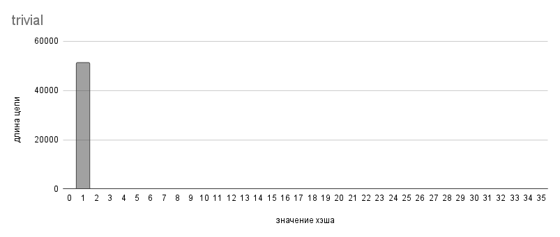
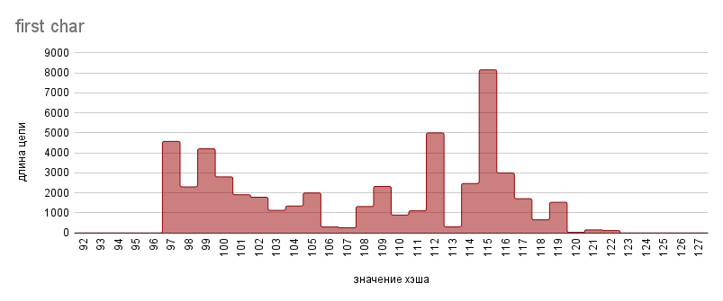
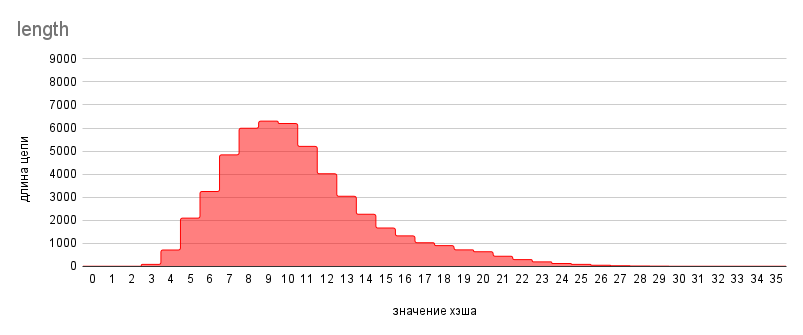
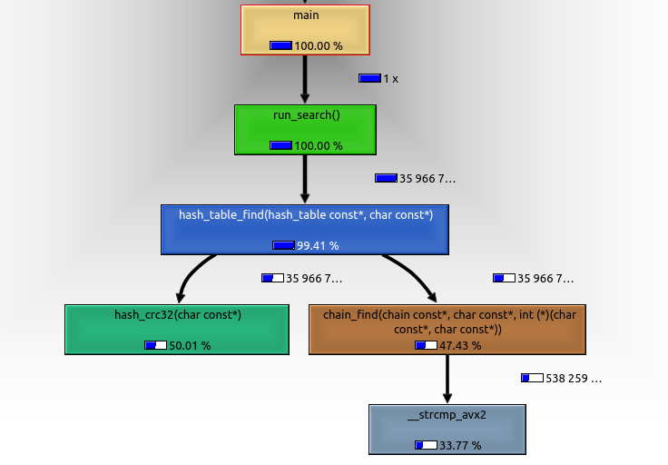
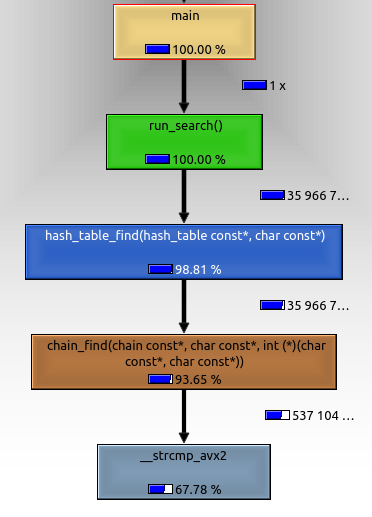
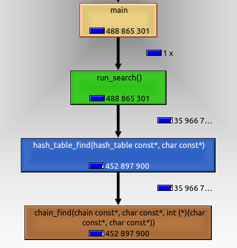
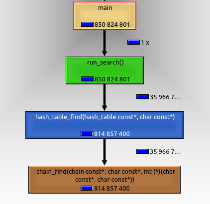

# Исследование хэш-таблиц
В данной работе будет реализована хэш-таблица методом цепочек, а также исследованы некоторые хэш-функции и оптимизации поиска.

## Введение
**Хэш-таблица** - структура данных, которая хранит некоторые элементы и предоставляет возможность их быстрого добавления, удаления и поиска. Элементы хэш-таблицы называются **ключами**.

Общий принцип работы хэш-таблиц следующий: перед каждым запросом некоторая **хэш-функция** сопоставляет ключу натуральное число - **хэш**, по которому определяется дальнейшая обработка запроса. При хорошо подобранной хэш-функции и некоторых допущениях можно добиться того, что все запросы работают за O(1).

В этой работе исследуется **хэш-таблица методом цепочек**. В первом приближении она представляет собой массив, элементами которого являются ключи. Индекс ключа равен его хэшу по модулю размера массива.

Но есть *проблема*: возможно ситуация, когда у разных ключей хэши совпадают (по модулю) - это называется **коллизией**. В этом случае мы не сможем сохранить оба этих ключа в хэш-таблице.

*Решение*: будем в массиве хранить не ключи, а списки ключей.

Чтобы данная структура данных обрабатывала запросы за O(1) необходим ряд следующих требований:

*  хэш-функция должна равномерно распределять элементы по таблице, чтобы списки получались примерно одинаковой длины
*  алгоритм пересчета хэша должен для одного и того же ключа всегда выдавать один и тот же хэш
*  алгоритм пересчета хэша должен работать быстро

В данной работе ключи - строки, хэш - беззнаковое целое.
```C++
typedef unsigned long hash_val;
typedef const char   *hash_key;
typedef       char   *hash_t  ;
```
## Часть 1. Исследование хэш-функций
Ниже будут представлены различные хэш-функции и их анализ. Измерения проводились при объеме базы в ~50000 слов и хэш-таблице емкостью 5701.

**TRIVIAL**

$hash(\forall key) = 1$




**FIRST CHAR**

$hash(key) = key[0]$




**LENGTH**

$hash(key) = strlen(key)$




**SUM CHAR**

$hash(key) = \sum\limits_{i=0}^{n-1} key[i]$, где $n=strlen(key)$


**ROL HASH**

$hash_0 = key[0]$

$hash_i = rol(hash_{i-1})\oplus key[i]$

$hash(key) = hash_{n-1}$, где $n=strlen(key)$


**ROR HASH**

$hash_0 = key[0]$

$hash_i = ror(hash_{i-1})\oplus key[i]$

$hash(key)=hash_{n-1}$, где $n=strlen(key)$


**CRC32**

$hash = CRC32$


### Анализ хэш-функций
Из графиков видно, что функции ***trivial, first_char, length, sum_char*** не удовлетворяют требованию о равномерном распределении ключей. Дальше эти функции рассматриваться не будут.

| Хэш-функция | Среднеквадратичное отклонение | *Время, мс    |
|-------------|-------------------------------|---------------|
| CRC32       | 3.0                           | 46.19 +- 0.12 |
| ROL hash    | 4.2                           | 10.69 +- 0.10 |
| ROR hash    | 8.0                           | 10.65 +- 0.05 |

*В столбце `Время, мс` приведено время десятикратного пересчета значений хэш-функции для каждого слова из базы.

Что касается ***ROL hash, ROR hash, CRC32**, они покрывают диапазон с приемлемым среднеквадратичным отклонением, их вполне можно использовать в хэш-таблицах. Для дальнейших исследований будет выбрана **CRC32**, т.к. у этой хэш-функции есть аппаратное ускорение, которое будет рассмотрено далее.

## Часть 2. Исследование оптимизаций поиска
### Методика измерений

Измерения проводились в среде:

| CPU                   | OS                     | Compiler   | Options |
|-----------------------|------------------------|------------|---------|
| AMD Ryzen 7 PRO 5850U | Linux Mint 21 Cinnamon | gcc 11.3.0 | -O3     |

| Диапазон хэш-таблицы  | База хэш-таблицы       | Хэш-функция          |
|-----------------------|------------------------|----------------------|
| [0; 1907)             | ~50000 слов            | CRC32                |

В таблицах будет приведено время работы функции поиска каждого ключа из базы хэш-таблицы (далее просто "функция поиска") с флагом оптимизации `-O3`. Для его определения программа считала время нескольких итераций функции поиска и затем усредняла. Для повышения точности итоговое время бралось как среднее от времен пяти запусков данной программы.

### Оптимизация кеша

В версиях **v1-v4** для измерения промахов в кеше функция поиска в рамках одного запуска будет вызываться `500` раз.

На картинках будет показано количество промахов в кеше L1, измеренное профайлером.

**v1 (base line)**

В данной версии хеш-таблица представляет собой массив "классических" списков. Такие списки каждую вершину хранят в отдельном блоке динамической памяти. Это неоптимально с точки зрения кеша, т.к. во время обхода такой цепочки маловероятно, что очередная вершина окажется на высоком уровне кеша.


| версия         | время, мс     |
|----------------|---------------|
| v1 (base line) | 13.95 +- 0.04 |

**v2 (cache list)**

Чтобы увеличить процент попаданий в кеш, можно использовать "cache-friendly" списки. В отличие от "классических", они хранят все вершины в едином блоке динамической памяти, который реаллоцируется при необходимости. Так как в хэш-таблицу ключи только добавляются (причем добавляются только в начало списка), порядок расположения вершин в памяти будет соответствовать порядку в списке (это следует из реализации cache-friendly списков).

Как видно, промахов стало меньше:


Мы получили ускорение в `1.5` раза.

| версия          | время, мс     | относительное ускорение |
|-----------------|---------------|-------------------------|
| v1 (base line)  | 13.95 +- 0.04 | 1.00                    |
| v2 (cache list) |  9.43 +- 0.01 | 1.48 +- 0.01            |

**v3 (cache key)**

Вершинами "cache-friendly" списка являются структуры:
```C++
struct cache_list_node
{
    const void *data;   ///< указатель на элемент листа
    size_t      prev;   ///< индекс предыдущей вершины листа
    size_t      next;   ///< индекс следующей вершины листа
};
```

В v2 ключи хэш-таблицы хранились в едином блоке динамической памяти, который выделялся на этапе загрузки базы в оперативную память. Затем содержимое блока разбивалось на лексемы с помощью библиотечной функции `strtok`, на которые и указывают поля `.data` вершин листа. Но лексемы хранятся, в том порядке, в котором они находились в файле, в нашем случае - в алфавитном. При обходе цепочки мы имеем дело с ключами, у которых одинаковый хэш. Поэтому для кеша оптимальнее будет, если ключи с одинаковым хэшом будут идти подряд, причем в порядке, который задается при обходе цепочки. Чтобы добиться этого, можно после построения хэш-таблицы пересортировать ключи, а потом обновить поля `.data` в цепочках.

Промахов стало еще меньше:


Данная оптимизация ускорила время поиска на `10 %`.

| версия          | время, мс    | относительное ускорение |
|-----------------|--------------|-------------------------|
| v2 (cache list) | 9.43 +- 0.01 | 1.000                   |
| v3 (cache key)  | 8.54 +- 0.01 | 1.104 +- 0.002          |

**v4.1 (aligned key)**

Заметим, что длина слов в базе меньше 32 символов. Тогда под каждый ключ можно выделить 32 байта, и хранить как поле структуры, вместо указателя, как в v3. Можно вдобавок хранить сразу 2 ключа, выровненных по 64-байтной границе, в одной вершине, чтобы они попали в одну кеш-линию.

```C++
struct __attribute__ ((aligned (64))) chain_node
{
    char keys[64]; // 2 ключа в одной вершине

    size_t prev;
    size_t next;
};
```

Но данная оптимизация, наоборот, увеличивает количество промахов в кеш, замедляя программу.


| версия            | время, мс    | относительное ускорение |
|-------------------|--------------|-------------------------|
| v3   (cache key)  | 8.54 +- 0.01 | 1.104 +- 0.002          |
| v4.1 (cache node) | 8.30 +- 0.04 | 1.028 +- 0.006          |

Последняя оптимизация увеличила производительность на `2.8 +- 0.6 %`, продолжать оптимизировать кеш большого смысла не имеет.

В итоге оптимизируя кеш, мы добились ускорения в `1.7` раза.

| версия          | относительное ускорение | абсолютное ускорение |
|-----------------|-------------------------|----------------------|
| v1 (base line)  | 1.00                    | base line            |
| v2 (cache list) | 1.48  +- 0.01           | 1.48 +- 0.01         |
| v3 (cache key)  | 1.104 +- 0.002          | 1.63 +- 0.01         |
| v4 (cache node) | 1.028 +- 0.006          | 1.68 +- 0.01         |

### Оптимизации с использованием ассемблера

Далее на картинках будет изображен граф вызовов. На нем для каждой функции в процентах будет выражена доля времени, когда программа находится в данной функции или другой, лежащей поверх данной в стеке вызовов.

**v5 (crc32 asm)**

Для начала воспользуемся профайлером, чтобы найти узкое место.



Больше всего времени тратится на пересчет хэша, поэтому его нужно оптимизировать в первую очередь. Для этого можно заменить первоначальную реализацию:

```C++
hash_val hash_crc32(hash_key elem)
{
    const unsigned polynom = 0x04C11DB7;
    hash_val        result = -1U;

    for (size_t cnt = 0; elem[cnt] != '\0'; ++cnt)
    {
        result = result ^ (hash_val) elem[cnt];

        for (size_t bit = 7; bit != 0; --bit)
        {
            unsigned mask = -(result & 1);
            result = (result >> 1) ^ (polynom & mask);
        }
    }

    return ~result;
}
```
на ассемблерную:
```s
;======================================================================
; unsigned long crc32_asm(const char *)
;======================================================================
; Entry:    RDI - указатель на строку длиной не более 32 байт
;----------------------------------------------------------------------
; Expects:  none
;----------------------------------------------------------------------
; Exit:     RAX - crc32 хэш строки
; Destroys: RAX
;======================================================================

crc32_asm:  xor   rax, rax

            crc32 rax, qword [rdi     ]
            crc32 rax, qword [rdi +  8]
            crc32 rax, qword [rdi + 16]
            crc32 rax, qword [rdi + 24]

            ret
```


Заметим, что *hash_crc32()* и *crc32_asm()* не эквивалентны, но ассемблерная версия имеет среднеквадратичное отклонение, равное C-шной с точностью до десятых. Заменив реализацию, мы получили ускорение в `1.8` раза. 

| версия          | время, мс    | относительное ускорение |
|-----------------|--------------|-------------------------|
| v4 (cache node) | 8.30 +- 0.04 | 1.00                    |
| v5 (crc32 asm)  | 4.64 +- 0.02 | 1.79 +- 0.01            |

**v6 (strcmp asm noinline)**

Теперь узким местом является функция сравнения строк:



Для оптимизации сравнения строк можно воспользоваться тем свойством, что их длина в нашем случае не превосходит 32 символов, т.е. они помещаются в `ymm` регистр. Это дает нам возможность использовать SIMD для их сравнения.

Заменив библиотечную `strcmp` на ассемблерную версию:
```C++
static int strcmp_asm(hash_key fst, hash_key sec) __attribute__((noinline));
static int strcmp_asm(hash_key fst, hash_key sec)
{
    int result = 0;

    asm(
    ".intel_syntax noprefix\n"

    "vmovdqu ymm0, ymmword ptr [%1]         /* ymm0 <- fst       */\n"
    "vptest  ymm0, ymmword ptr [%2]         /* cf = (fst == sec) */\n"

    "seta  %b0\n"

    ".att_syntax prefix\n"

    : "=r"(result)
    : "r"(fst), "r"(sec)
    : "ymm0", "cc"
    );

    return result;
}
```
получили ускорение в 2 раза:

| версия                   | время, мс    | относительное ускорение |
|--------------------------|--------------|-------------------------|
| v5 (crc32 asm)           | 4.64 +- 0.02 | 1.00                    |
| v6 (strcmp asm noinline) | 2.30 +- 0.02 | 2.02 +- 0.03            |

Хочу обратить внимание, что если в ассемблерной вставке вместо `seta %b0` использовать `setnc %b0`, что тоже правильно, то ускорение было бы всего в `1.4` раза.

| версия          | время, мс    | относительное ускорение |
|-----------------|--------------|-------------------------|
| v5  (crc32 asm) | 4.64 +- 0.02 | 1.00                    |
| v6*             | 3.37 +- 0.03 | 1.38 +- 0.02            |

Возможно это связано с тем, что условных ветвлений стало меньше:

столько их было при `700` запусках функции поиска с `seta`:



столько стало при `setnc` (кол-во запусков функции поиска не изменилось):



**v7 (strcmp asm inline)**

Так как обращение к функции `strcmp_asm()` происходит слишком часто было бы выгодно "заинлайнить" ее, чтобы не тратить время на ***call*** и ***ret***.

Но замена прототипа

```C++
static int strcmp_asm(hash_key fst, hash_key sec) __attribute__((noinline));
```
на
```C++
static __always_inline int strcmp_asm(hash_key fst, hash_key sec);
```

наоборот замедлило функцию в 2 раза:

| версия                   | время, мс    | относительное ускорение |
|--------------------------|--------------|-------------------------|
| v6 (strcmp asm noinline) | 2.30 +- 0.02 | 1.00                    |
| v7.1                     | 4.42 +- 0.03 | 0.52 +- 0.01            |

Можно самому "заинлайнить" функцию сравнения с помощью интринсиков:
```C++
bool chain_find(const chain *const lst, const char *const key, int (*key_cmp)(const char *, const char *))
{
    log_verify(lst     != nullptr, false);
    log_verify(key     != nullptr, false);
    log_verify(key_cmp != nullptr, false);

    chain_node *dup_fict = $fictional;
    chain_node *dup_node = dup_fict + dup_fict->next;

    __m256i intrin_key = _mm256_loadu_si256((__m256i *) key);

    while (dup_node != dup_fict)
    {
        __m256i key_1 = _mm256_loadu_si256((__m256i *) (dup_node->keys     ));
        __m256i key_2 = _mm256_loadu_si256((__m256i *) (dup_node->keys + 32));

        int result1 = _mm256_testc_si256(key_1, intrin_key);
        int result2 = _mm256_testc_si256(key_2, intrin_key);

        if (result1 || result2) return true;

        dup_node = dup_fict + dup_node->next;
    }

    return false;
}
```
Это оказалось лучше, чем ***__always_inline***, но все равно хуже чем ***noinline***.

| версия                   | время, мс    | относительное ускорение |
|--------------------------|--------------|-------------------------|
| v6 (strcmp asm noinline) | 2.30 +- 0.02 | 1.00                    |
| v7.2                     | 2.85 +- 0.02 | 0.81 +- 0.01            |

v7 не улучшила время v6, эта попытка неудачна и далее в статистике отображаться не будет.

**v8 (find opt)**

Последняя, еще не оптимизированная, функция - chain_find(). Заметим, что в хэш-таблицу ключи только добавляются. Это значит, что вершины лежат подряд, как в массиве. Поэтому для обхода цепи необязательно использовать поле `.next`, можно просто итерироваться, как в массиве.

```C++
bool chain_find(const chain *const lst, const char *const key, int (*key_cmp)(const char *, const char *))
{
    log_verify(lst     != nullptr, false);
    log_verify(key     != nullptr, false);
    log_verify(key_cmp != nullptr, false);

    chain_node *dup_node = $fictional;

    for (size_t size_left = $size; size_left > 0; size_left--)
    {
        ++dup_node;

        if (strcmp_asm(key, dup_node->keys     ) == 0) return true;
        if (strcmp_asm(key, dup_node->keys + 32) == 0) return true;
    }

    return false;
}
```

Теперь, если функция ***strcmp_asm()*** объявлена как ***__always_inline***, мы получаем ускорение относительно v6.

| версия                   | время, мс    | относительное ускорение |
|--------------------------|--------------|-------------------------|
| v6 (strcmp asm noinline) | 2.30 +- 0.02 | 1.000                   |
| v8 (find opt)            | 2.21 +- 0.02 | 1.041 +- 0.018          |

Так как последняя версия быстрее всего лишь на `4%`, а неоптимизированных функций больше нет,  принято решение о прекращении оптимизаций.

Используя ассемблер для оптимизаций, удалось добиться ускорения в `3.8` раза.

| версия                   | относительное ускорение | абсолютное ускорение |
|--------------------------|-------------------------|----------------------|
| v4 (cache node)          | 1.00                    | base line            |
| v5 (crc32 asm)           | 1.79 +- 0.01            | 1.79 +- 0.01         |
| v6 (strcmp asm noinline) | 2.02 +- 0.03            | 3.61 +- 0.05         |
| v8 (find opt)            | 1.04 +- 0.02            | 3.76 +- 0.05         |

### Итог

В итоге удалось добиться ускорения в `6.3` раза.

| версия         | время, мс     | абсолютное ускорение |
|----------------|---------------|----------------------|
| v1 (base line) | 13.95 +- 0.04 | base line            |
| v8 (find opt)  |  2.21 +- 0.02 | 6.3 +- 0.1           |

Для этого нам пришлось менять структуры данных, чтобы оптимальнее использовать кэш, а также пользоваться допущениями, применимыми к конкретно нашему случаю. Компилятор на такое не способен, так как он должен генерировать ассемблерный код, работающий во всех случаях. Нам пришлось немного пожертвовать универсальностью, переносимостью кода, но ускорение в `6.3` раза того стоит.
