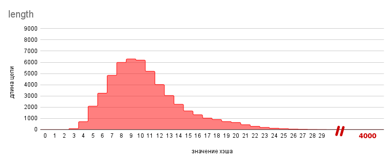
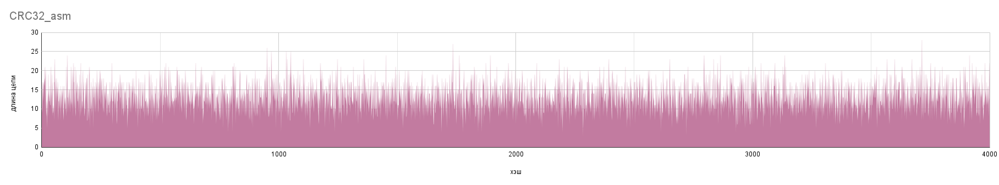

# Исследование хэш-таблиц
В данной работе будет реализована хэш-таблица методом цепочек, а также исследованы некоторые хэш-функции и оптимизации поиска.

## Введение
**Хэш-таблица** - структура данных, которая хранит некоторые элементы и предоставляет возможность их быстрого добавления, удаления и поиска. Элементы хэш-таблицы называются **ключами**.

Общий принцип работы хэш-таблиц следующий: перед каждым запросом некоторая **хэш-функция** сопостовляет ключу натуральное число - **хэш**, по которому определяется дальнейшая обработка запроса. При хорошо подобранной хэш-функции и некоторых допущениях можно добится того, что все запросы работают за O(1).

В этой работе исследуется **хэш-таблица методом цепочек**. В первом приближении хэш-таблица могла бы быть массивом, элементами которого являются ключи (с такой реализацией могут возникнуть проблема, см. ниже). Индекс ключа равен его хэшу по модулю размера массива.

Но есть *проблема*: возможно ситуация, когда у разных ключей хэши совпадают (по модулю) - это называется **коллизией**. В этом случае мы не сможем сохранить оба этих ключа в хэш-таблице.

*Решение*: будем в массиве хранить не ключи, а списки ключей.

Чтобы данная структура данных обрабатывала запросы за O(1) необходим ряд следующих требований:
*  хэш-функция должна равномерно распределять элементы по таблице, чтобы списки получались приблизительно равными по длине
*  алгоритм пересчета хэша должен для одного и того же ключа всегда выдавать один и тот же хэш
*  алгоритм пересчета хэша должен работать быстро

В данной работе ключи - строки, хэш - беззнаковое целое.
```C++
typedef unsigned long hash_val;
typedef const char   *hash_key;
typedef       char   *hash_t  ;
```
## Часть 1. Исследование хэш-функций
Ниже будут представлены различные хэш-функции и их анализ. Измерения проводились при объеме базы в ~50000 слов и хэш-таблице емкостью 1907.

**TRIVIAL**

$hash(\forall key) = 1$


**FIRST CHAR**

$hash(key) = key[0]$


**LENGTH**

$hash(key) = strlen(key)$



**SUM CHAR**

$hash(key) = \sum\limits_{i=0}^{n-1} key[i]$, где $n=strlen(key)$


**ROL**

$hash_0 = key[0]$

$hash_i = rol(hash_{i-1})\oplus key[i]$

$hash(key) = hash_{n-1}$, где $n=strlen(key)$


**ROR**

$hash_0 = key[0]$

$hash_i = ror(hash_{i-1})\oplus key[i]$

$hash(key)=hash_{n-1}$, где $n=strlen(key)$


**CRC32**

$hash = CRC32$


### Анализ хэш-функций
| Хэш-функция | Дисперсия   | *Время (-O3), мс |
|-------------|-------------|------------------|
| CRC32       | 26.3        | 46.19 +- 0.12    |
| ROL         | 53.2        | 10.69 +- 0.10    |
| ROR         | 102.5       | 10.65 +- 0.05    |
| sum_char    | 977.6       |       --         |
| first char  | ~97'000     |       --         |
| length      | ~133'000    |       --         |
| trivial     | > 1'000'000 |       --         |

*В столбце `Время(-O3), мс` приведено время десятикратного пересчета значений хэш-функции для каждого слова из базы.

* **trivial, first_char**

  * "trivial" переводит все строки в один список, а "first_char" не может принимать значения больше `256`, независимо от словаря и размеров хэш-таблицы. Это приводит к длинным цепям и медленному поиску ключей в таблице.

* **length, sum_char**

  * Для "length" и "sum_char" ограничения на диапазон значений накладывают особенности английских слов, из которых состоит база: их длина в среднем не превышает 10 символов. Поэтому эти хэш-функции тоже не подходят.

* **ROR, ROL, CRC32**

  * Данные функции имеют гораздо лучшие показатели, их вполне разумно использовать в хэш-таблице. Интересное замечание по поводу ROL и ROR: компилятор реализовал набор логических операций в виде инструкций rol и ror даже с флагом `-O0`.
  
  
  

  На данном этапе ROL и ROR быстрее CRC32, но CRC32 можно ускорить. Поэтому во второй части для исследования оптимизаций, будем использовать CRC32.

## Часть 2. Исследование оптимизаций поиска
### Среда тестирования

| CPU                   | OS                     | Compiler   | Options |
|-----------------------|------------------------|------------|---------|
| AMD Ryzen 7 PRO 5850U | Linux Mint 21 Cinnamon | gcc 11.3.0 | -O3     |

| Диапазон хэш-таблицы | База хэш-таблицы | Хэш-функция |
|----------------------|------------------|-------------|
| [0; 1907)            | ~50000 слов      | CRC32       |

### Предосторожность

**v0 (DEBUG)**

Перед тем как начать, обратим внимание, что перед исследованием оптимизаций важно отключить инструменты для дебага, такие как верификаторы, ассерты и т.д. Для этого сравним две версии: v0 (DEBUG) и v1 (base line), которые отличаются лишь в этом.

| версия         | (-O1) время, мс | (-O2) время, мс | (-O3) время, мс |
|----------------|-----------------|-----------------|-----------------|
| v0 (debug)     | 14.10 +- 0.03   | 14.14 +- 0.07   | 14.06 +- 0.09   |
| v1 (base line) | 13.75 +- 0.04   | 13.78 +- 0.05   | 13.79 +- 0.06   |

### Оптимизация кеша

**v1 (base line)**

В данной версии хеш-таблица представляет собой массив "классических" списков. Такие списки каждую вершину хранят в отдельном блоке динамической памяти. Это неоптимально с точки зрения кеша, т.к. во время обхода такой цепочки маловероятно, что очередная вершина окажется на высоком уровне. В результате у нас `22.13%` промахов кеша.


**v2 (cache list)**

Чтобы увеличить процент попаданий в кеш, можно использовать "cache-friendly" списки. В отличие от "классических", они хранят все вершины в едином блоке динамической памяти, который реаллоцируется при необходимости. Так как в хэш-таблицу ключи только добавляются (причем добавляются только в начало списка), порядок расположения вершин в памяти будет соответствовать порядку в списке (это следует из реализации cache-friendly списков).

Как видно, промахов стало меньше:


| версия          | (-O1) время, мс | (-O2) время, мс | (-O3) время, мс | (-O3) относительное ускорение |
|-----------------|-----------------|-----------------|-----------------|-------------------------------|
| v1 (base line)  | 13.75 +- 0.04   | 13.78 +- 0.05   | 13.79 +- 0.06   | 1.00                          |
| v2 (cache list) |  9.28 +- 0.06   |  9.16 +- 0.07   |  9.23 +- 0.05   | 1.49 +- 0.02                  |

**v3 (cache key)**

Вершинами "cache-friendly" списка являются структуры:
```C++
struct cache_list_node
{
    const void *data;   ///< указатель на элемент листа
    size_t      prev;   ///< индекс предыдущей вершины листа
    size_t      next;   ///< индекс следущей вершины листа
};
```

В v2 ключи хэш-таблицы хранились в едином блоке динамической памяти, который выделялся на этапе загрузки базы в оперативную память. Затем содержимое блока разбивалось на лексемы с помощью библиотечной функции `strtok`, на которые и указывают поля `.data` вершин листа. Но лексемы хранятся, в том порядке, в котором они находились в файле, в нашем случае - в алфавитном. При обходе цепочки мы имеем дело с ключами, у которых одинаковый хэш. Поэтому для кеша оптимальнее будет, если ключи с одинаковым хэшом будут идти подряд, причем в порядке, который задается при обходе цепочки. Чтобы добится этого, можно после построения хэш-таблицы пересортировать ключи, а потом обновить поля `.data` в цепочках.

Промахов и правда стало еще меньше:


| версия          | (-O1) время, мс | (-O2) время, мс | (-O3) время, мс | (-O3) относительное ускорение |
|-----------------|-----------------|-----------------|-----------------|-------------------------------|
| v2 (cache list) | 9.28 +- 0.06    | 9.16 +- 0.07    | 9.23 +- 0.05    | 1.00                          |
| v3 (cache key)  | 8.40 +- 0.05    | 8.52 +- 0.04    | 8.41 +- 0.02    | 1.10 +- 0.01                  |

**v4 (cache node)**

Заметим, что длина слов в базе меньше 64 символов. Тогда под каждый ключ можно выделить 32 байта, и хранить как поле структуры, вместо указателя, как в v3.

```C++
struct chain_node
{
    char keys[64]; // 2 строки в одной вершине

    size_t prev;
    size_t next;
};
```


| версия          | (-O1) время, мс | (-O2) время, мс | (-O3) время, мс | (-O3) относительное ускорение |
|-----------------|-----------------|-----------------|-----------------|-------------------------------|
| v3 (cache key)  | 8.40 +- 0.05    | 8.52 +- 0.04    | 8.41 +- 0.02    | 1.000                         |
| v4 (cache node) | 8.11 +- 0.02    | 8.09 +- 0.01    | 8.10 +- 0.01    | 1.038 +- 0.004                |

Последняя оптимизация увеличила производительность на `3.8 +- 0.4 %`, продолжать оптимизировать кеш большого смысла не имеет.

| версия          | (-O3) относительное ускорение | (-O3) абсолютное ускорение |
|-----------------|-------------------------------|----------------------------|
| v1 (base line)  | 1.00                          | 1.00                       |
| v2 (cache list) | 1.49 +- 0.02                  | 1.49 +- 0.02               |
| v3 (cache key)  | 1.10 +- 0.01                  | 1.64 +- 0.01               |
| v4 (cache node) | 1.038 +- 0.004                | 1.70 +- 0.01               |

### Оптимизации с использованием ассемблера

**v5 (crc32 asm)**

Для начала воспользуемся профайлером, чтобы найти узкое место.


Больше всего времени тратится на пересчет хэша, поэтому его нужно соптимизировать в первую очередь. Для этого можного заменить первоначальную реализацию:

```C++
hash_val hash_crc32(hash_key elem)
{
    const unsigned polynom = 0x04C11DB7;
    hash_val        result = -1U;

    for (size_t cnt = 0; elem[cnt] != '\0'; ++cnt)
    {
        result = result ^ (hash_val) elem[cnt];

        for (size_t bit = 7; bit != 0; --bit)
        {
            unsigned mask = -(result & 1);
            result = (result >> 1) ^ (polynom & mask);
        }
    }

    return ~result;
}
```
на ассемблерную:
```s
;======================================================================
; unsigned long crc32_asm(const char *)
;======================================================================
; Entry:    RDI - указатель на строку длиной не более 32 байт
;----------------------------------------------------------------------
; Expects:  none
;----------------------------------------------------------------------
; Exit:     RAX - crc32 хэш строки
; Destroys: RAX
;======================================================================

crc32_asm:  xor   rax, rax

            crc32 rax, qword [rdi     ]
            crc32 rax, qword [rdi +  8]
            crc32 rax, qword [rdi + 16]
            crc32 rax, qword [rdi + 24]

            ret

```

Заметим, что данные функции не эквивалентны, но ассемблерная версия имеет дисперсию, равную `27.3`, что почти совпадает с C-шной дисперсией `26.3`. Зато она работает быстрее, что гораздо важнее.



| версия          | (-O1) время, мс | (-O2) время, мс | (-O3) время, мс | (-O3) относительное ускорение |
|-----------------|-----------------|-----------------|-----------------|-------------------------------|
| v4 (cache node) | 8.11 +- 0.02    | 8.09 +- 0.01    | 8.10 +- 0.01    | 1.00                          |
| v5 (crc32 asm)  | 4.55 +- 0.04    | 4.51 +- 0.01    | 4.54 +- 0.04    | 1.78 +- 0.02                  |

**v6 (strcmp asm)**

Теперь, как видно, узким местом является функция сравнения строк:


Для оптимизации сравнения строк можно воспользоваться тем свойством, что их длина в нашем случае не превосходит 32 символов, т.е. они помещаются в `ymm` регистр. Это дает нам возможность использовать SIMD для их сравнения.

Заменив библиотечную `strcmp` на ассемблерную версию:
```C++
static __always_inline int strcmp_asm(hash_key fst, hash_key sec)
{
    int result = 0;

    asm(
    ".intel_syntax noprefix\n"

    "vmovdqu ymm0, ymmword ptr [%1]         /* ymm0 <- fst       */\n"
    "vptest  ymm0, ymmword ptr [%2]         /* cf = (fst == sec) */\n"

    "seta  %b0\n"

    ".att_syntax prefix\n"

    : "=r"(result)
    : "r"(fst), "r"(sec)
    : "ymm0", "cc"
    );

    return result;
}

```
получили следующую статистику:

| версия          | (-O1) время, мс | (-O2) время, мс | (-O3) время, мс | (-O3) относительное ускорение |
|-----------------|-----------------|-----------------|-----------------|-------------------------------|
| v5 (crc32 asm)  | 4.55 +- 0.04    | 4.51 +- 0.01    | 4.54 +- 0.04    | 1.00                          |
| v6 (strcmp asm) | 2.29 +- 0.01    | 2.25 +- 0.02    | 2.28 +- 0.01    | 1.99 +- 0.03                  |

Хочу обратить внимание, что если в ассемблерной вставке вместо `seta %b0` использовать `setnc %b0`, что тоже правильно, то показатели были бы совсем другими:

| версия          | (-O1) время, мс | (-O2) время, мс | (-O3) время, мс | (-O3) относительное ускорение |
|-----------------|-----------------|-----------------|-----------------|-------------------------------|
| v5 (crc32 asm)  | 4.55 +- 0.04    | 4.51 +- 0.01    | 4.54 +- 0.04    | 1.00                          |
| v6*             | 3.38 +- 0.04    | 3.32 +- 0.02    | 3.30 +- 0.01    | 1.38 +- 0.02                  |

Возможно это связано с тем, что условие `CF == 0 & ZF == 0`, которое проверяется инструкцией `seta` более строгое, чем `CF == 0` при `setnc`, а в большинстве случаев `ZF = 0`, так как иное возможно только при `[%1] & [%2] = 0`, что достигается, когда `[%1] = 0` или `[%2] = 0`.

**v7 (intrin find)**

Единственное, что осталось нетронутым - функция нахождения элемента в цепочке, которая состоит из цикла обхода вершин. На данном этапе она занимает больше всего времени.


Можно попробовать развернуть цикл:
```C++
    while (dup_fst != dup_fict)
    {
        __m256i fst_key_1 = _mm256_loadu_si256((__m256i *) (dup_fst->keys));
        __m256i fst_key_2 = _mm256_loadu_si256((__m256i *) (dup_fst->keys + 32));

        __m256i sec_key_1 = _mm256_loadu_si256((__m256i *) (dup_sec->keys));
        __m256i sec_key_2 = _mm256_loadu_si256((__m256i *) (dup_sec->keys + 32));

        int result1 = _mm256_testc_si256(fst_key_1, intrin_key);
        int result2 = _mm256_testc_si256(fst_key_2, intrin_key);
        int result3 = _mm256_testc_si256(sec_key_1, intrin_key);
        int result4 = _mm256_testc_si256(sec_key_2, intrin_key);

        __m128i total = _mm_set_epi32(result1, result2, result3, result4);

        if (!_mm_testz_si128(total, total)) { return true;  }
        if (dup_sec == dup_fict)            { return false; }

        dup_fst = dup_fict + dup_sec->next;
        dup_sec = dup_fict + dup_fst->next;
    }
```
Теперь в нем за итерацию обрабатывается по 4 ключа, вместо двух, как это было в предыдущих версиях.

| версия           | (-O1) время, мс | (-O2) время, мс | (-O3) время, мс | (-O3) относительное ускорение |
|------------------|-----------------|-----------------|-----------------|-------------------------------|
| v6 (strcmp asm)  | 2.29 +- 0.01    | 2.25 +- 0.02    | 2.28 +- 0.01    | 1.00                          |
| v7 (intrin find) | 3.01 +- 0.02    | 2.98 +- 0.01    | 3.01 +- 0.02    | 0.76 +- 0.01                  |

Так как эта оптимизация сделала функцию медленне, к тому же еще содержит машиннозависимые интринсики, она не оправдана. Больше неоптемизированыых функций нет, поэтому принято решение о прекращении дальнейших оптимизаций.

Сводка по ассемблерным оптимизациям:

| версия          | (-O3) относительное ускорение | (-O3) абсолютное ускорение |
|-----------------|-------------------------------|----------------------------|
| v4 (cache node) | 1.00                          | 1.00                       |
| v5 (crc32 asm)  | 1.78 +- 0.02                  | 1.78 +- 0.02               |
| v6 (strcmp asm) | 1.99 +- 0.03                  | 3.55 +- 0.02               |

### Итог

| версия          | (-O3) относительное ускорение | (-O3) абсолютное ускорение |
|-----------------|-------------------------------|----------------------------|
| v1 (base line)  | 1.00                          | 1.00                       |
| v2 (cache list) | 1.49  +- 0.02                 | 1.49 +- 0.02               |
| v3 (cache key)  | 1.10  +- 0.01                 | 1.64 +- 0.01               |
| v4 (cache node) | 1.038 +- 0.004                | 1.70 +- 0.01               |
| v5 (crc32 asm)  | 1.78  +- 0.02                 | 3.02 +- 0.05               |
| v6 (strcmp asm) | 1.99  +- 0.03                 | 6.03 +- 0.02               |
