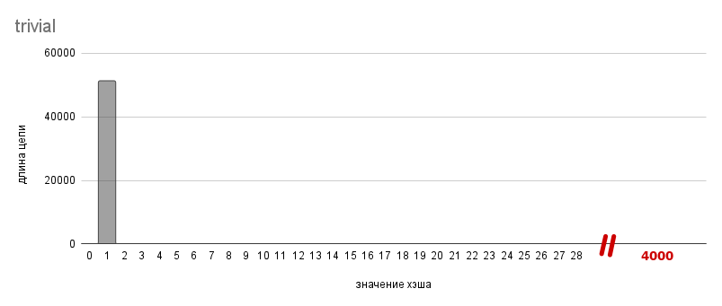
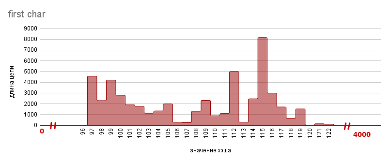
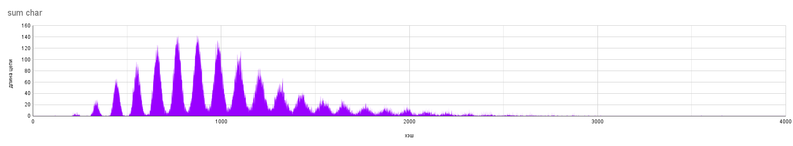
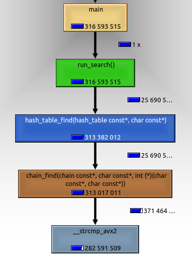
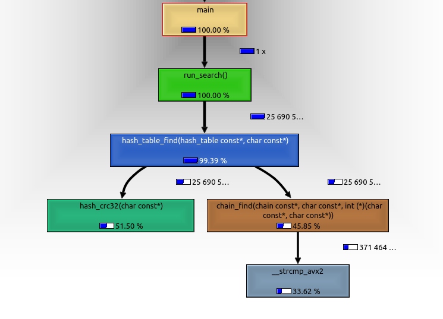

# Исследование хэш-таблиц
В данной работе будет реализована хэш-таблица методом цепочек, а также исследованы некоторые хэш-функции и оптимизации поиска.

## Введение
**Хэш-таблица** - структура данных, которая хранит некоторые элементы и предоставляет возможность их быстрого добавления, удаления и поиска. Элементы хэш-таблицы называются **ключами**.

Общий принцип работы хэш-таблиц следующий: перед каждым запросом некоторая **хэш-функция** сопоставляет ключу натуральное число - **хэш**, по которому определяется дальнейшая обработка запроса. При хорошо подобранной хэш-функции и некоторых допущениях можно добиться того, что все запросы работают за O(1).

В этой работе исследуется **хэш-таблица методом цепочек**. В первом приближении она могла бы быть массивом, элементами которого являются ключи. Индекс ключа равен его хэшу по модулю размера массива.

Но есть *проблема*: возможно ситуация, когда у разных ключей хэши совпадают (по модулю) - это называется **коллизией**. В этом случае мы не сможем сохранить оба этих ключа в хэш-таблице.

*Решение*: будем в массиве хранить не ключи, а списки ключей.

Чтобы данная структура данных обрабатывала запросы за O(1) необходим ряд следующих требований:

*  хэш-функция должна равномерно распределять элементы по таблице, чтобы списки получались примерно одинаковой длины
*  алгоритм пересчета хэша должен для одного и того же ключа всегда выдавать один и тот же хэш
*  алгоритм пересчета хэша должен работать быстро

В данной работе ключи - строки, хэш - беззнаковое целое.
```C++
typedef unsigned long hash_val;
typedef const char   *hash_key;
typedef       char   *hash_t  ;
```
## Часть 1. Исследование хэш-функций
Ниже будут представлены различные хэш-функции и их анализ. Измерения проводились при объеме базы в ~50000 слов и хэш-таблице емкостью 4001 (простое число). **Имейте ввиду, что некоторые графики ниже содержат разрывы по оси абсцисс, для удобства отображения!**

**TRIVIAL**

$hash(\forall key) = 1$



**FIRST CHAR**

$hash(key) = key[0]$



**LENGTH**

$hash(key) = strlen(key)$


**SUM CHAR**

$hash(key) = \sum\limits_{i=0}^{n-1} key[i]$, где $n=strlen(key)$



**ROL HASH**

$hash_0 = key[0]$

$hash_i = rol(hash_{i-1})\oplus key[i]$

$hash(key) = hash_{n-1}$, где $n=strlen(key)$


**ROR HASH**

$hash_0 = key[0]$

$hash_i = ror(hash_{i-1})\oplus key[i]$

$hash(key)=hash_{n-1}$, где $n=strlen(key)$


**CRC32**

$hash = CRC32$


### Анализ хэш-функций
Из графиков видно, что функции ***trivial, first_char, length, sum_char*** не удовлетворяют требованию о равномерном распределении ключей. Дальше эти функции рассматриваться не будут.

Рассмотрим оставшиеся хэш-функции:

| Хэш-функция | Среднеквадратичное отклонение | *Время, мс    |
|-------------|-------------------------------|---------------|
| CRC32       | 3.0                           | 46.19 +- 0.12 |
| ROL hash    | 4.2                           | 10.69 +- 0.10 |
| ROR hash    | 8.0                           | 10.65 +- 0.05 |

*В столбце `Время, мс` приведено время десятикратного пересчета значений хэш-функции для каждого слова из базы. Оно было получено запуском `30000` итераций пересчета хэша для всего словаря хэ-таблицы.

Что касается ***ROL hash, ROR hash, CRC32**, они покрывают диапазон с приемлемым среднеквадратичным отклонением, их вполне можно использовать в хэш-таблицах. Для дальнейших исследований будет выбрана **CRC32**, т.к. у этой хэш-функции есть аппаратное ускорение, которое будет рассмотрено далее.

## Часть 2. Исследование оптимизаций поиска
### Методика измерений

Измерения проводились в среде:

| CPU                   | OS                     | Compiler   | Options |
|-----------------------|------------------------|------------|---------|
| AMD Ryzen 7 PRO 5850U | Linux Mint 21 Cinnamon | gcc 11.3.0 | -O3     |

| Диапазон хэш-таблицы  | База хэш-таблицы       | Хэш-функция          |
|-----------------------|------------------------|----------------------|
| [0; 1907)             | ~50000 слов            | CRC32                |

В таблицах будет приведено время работы функции поиска каждого ключа из базы хэш-таблицы (далее просто "функция поиска") с флагом оптимизации `-O3`. Для его определения программа считала время нескольких итераций функции поиска и затем усредняла. Количество итераций будет указано в отдельном столбце для каждой версии. Для повышения точности итоговое время бралось как среднее от времен пяти запусков программы.

### Оптимизация кеша

В версиях **v1-v4** для измерения промахов в кеше функция поиска в рамках одного запуска будет вызываться `500` раз.

На картинках будет показано количество промахов в кеше L1, измеренное профайлером. Обратить внимание стоит на общее количество промахов, которое показано на функции *main()*.

**v1 (base line)**

В данной версии хеш-таблица представляет собой массив "классических" списков. Такие списки каждую вершину хранят в отдельном блоке динамической памяти. Это неоптимально с точки зрения кеша, т.к. во время обхода такой цепочки маловероятно, что очередная вершина окажется на высоком уровне кеша.


| версия         | время на итерацию, мс | количество итераций |
|----------------|-----------------------|---------------------|
| v1 (base line) | 13.95 +- 0.04         | 5000                |

**v2 (cache list)**

Чтобы увеличить процент попаданий в кеш, можно использовать "cache-friendly" списки. В отличие от "классических", они хранят все вершины в едином блоке динамической памяти, который реаллоцируется при необходимости. Так как в хэш-таблицу ключи только добавляются (причем добавляются только в начало списка), порядок расположения вершин в памяти будет соответствовать порядку в списке (это следует из реализации cache-friendly списков).

Как видно, промахов стало меньше:


Мы получили ускорение в `1.5` раза.

| версия          | время на итерацию, мс | относительное ускорение | количество итераций |
|-----------------|-----------------------|-------------------------|---------------------|
| v1 (base line)  | 13.95 +- 0.04         | 1.00                    | 5000                |
| v2 (cache list) |  9.43 +- 0.01         | 1.48 +- 0.01            | 5000                |

**v3 (cache key)**

Вершинами "cache-friendly" списка являются структуры:
```C++
struct cache_list_node
{
    const void *data;   ///< указатель на элемент листа
    size_t      prev;   ///< индекс предыдущей вершины листа
    size_t      next;   ///< индекс следующей вершины листа
};
```

В v2 ключи хэш-таблицы хранились в едином блоке динамической памяти, который выделялся на этапе загрузки базы в оперативную память. Затем содержимое блока разбивалось на лексемы с помощью библиотечной функции `strtok`, на которые и указывают поля `.data` вершин листа. Но лексемы хранятся, в том порядке, в котором они находились в файле, в нашем случае - в алфавитном. При обходе цепочки мы имеем дело с ключами, у которых одинаковый хэш. Поэтому для кеша оптимальнее будет, если ключи с одинаковым хэшом будут идти подряд, причем в порядке, который задается при обходе цепочки. Чтобы добиться этого, можно после построения хэш-таблицы пересортировать ключи, а потом обновить поля `.data` в цепочках.

Промахов стало еще меньше:


Данная оптимизация ускорила время поиска на `10 %`.

| версия          | время на итерацию, мс | относительное ускорение | количество итераций |
|-----------------|-----------------------|-------------------------|---------------------|
| v2 (cache list) | 9.43 +- 0.01          | 1.000                   | 5000                |
| v3 (cache key)  | 8.54 +- 0.01          | 1.104 +- 0.002          | 7000                |

**v4 (iter opt)**

Заметим, что в хэш-таблицу ключи только добавляются. Это значит, что вершины лежат подряд, как в массиве. Поэтому итерироваться по вершинам можно так же, как и в массиве:

(было):
```C++
void *cache_list_find(const cache_list *const lst, const void *const target, int (*elem_cmp)(const void *, const void *))
{
    list_node *lst_fict = $fictional;
    list_node *lst_node = lst_fict + lst_fict->next;

    while (lst_node != $fictional)
    {
        if (elem_cmp($data, target) == 0) { $o return (void *) $data; }
        lst_node = lst_fict + $next;
    }

    return nullptr;
}
```
(стало):
```C++
void *cache_list_find_through(const cache_list *const lst, const void *const target, int (*elem_cmp)(const void *, const void *))
{
    list_node *lst_node = $fictional;

    for (size_t index = 0; index < $size; ++index)
    {
        ++lst_node;
        if (elem_cmp($data, target) == 0) {$o return (void *) $data; }
    }

    return nullptr;
}

```

Теперь мы не обращаемся к полю `.next`, и делаем меньше промахов.


Эта оптимизация ускорила поиск на `7 %`.

| версия          | время на итерацию, мс | относительное ускорение | количество итераций |
|-----------------|-----------------------|-------------------------|---------------------|
| v3 (cache key)  | 8.54 +- 0.01          | 1.000                   | 7000                |
| v4 (iter opt)   | 8.00 +- 0.02          | 1.068 +- 0.004          | 10000               |

**v5.1 (aligned key)**

Заметим, что длина слов в базе меньше 32 символов. Тогда под каждый ключ можно выделить 32 байта, и хранить как поле структуры, вместо указателя, как в v3. Можно вдобавок хранить сразу 2 ключа, выровненных по 64-байтной границе, в одной вершине, чтобы они попали в одну кеш-линию.

```C++
struct __attribute__ ((aligned (64))) chain_node
{
    char keys[64]; // 2 ключа в одной вершине

    size_t prev;
    size_t next;
};
```

Но промахов в кеше стало больше. Это связано с тем, что из-за выравнивания размер структуры - `128` байт, вместо `80`. `48` байт не содержат информации, а нужны лишь для выравнивания.



Не смотря на это, поиск ускорился ещё на `10 %`.

| версия             | время на итерацию, мс | относительное ускорение | количество итераций |
|--------------------|-----------------------|-------------------------|---------------------|
| v4   (iter opt)    | 8.00 +- 0.02          | 1.00                    | 10000               |
| v5.1 (aligned key) | 7.26 +- 0.02          | 1.10 +- 0.01            | 10000               |

**v5.2 (not aligned key)**

Посмотрим на статистику, которая получится, если использовать невыровненную структуру:

```C++
struct chain_node  // без __attribute__ ((aligned (64)))
{
    char keys[64]; // 2 ключа в одной вершине

    size_t prev;
    size_t next;
};
```


Промахов стало меньше, чем в v4 и v5.1, но на ускорение это почти не повлияло. Поэтому для улучшения времени продолжать оптимизировать кеш нерационально.

| версия                 | время на итерацию, мс | относительное ускорение | количество итераций |
|------------------------|-----------------------|-------------------------|---------------------|
| v5.1 (aligned key)     | 7.26 +- 0.02          | 1.000                   | 10000               |
| v5.2 (not aligned key) | 7.18 +- 0.02          | 1.011 +- 0.005          | 10000               |

В итоге, мы добились ускорения почти в 2 раза:

| версия                 |   абсолютное ускорение |
|------------------------|------------------------|
| v1 (base line)         |   base line            |
| v2 (cache list)        |   1.48 +- 0.01         |
| v3 (cache key)         |   1.63 +- 0.01         |
| v4 (iter opt)          |   1.74 +- 0.01         |
| v5.1 (aligned key)     | **1.92 +- 0.01**       |
| v5.2 (not aligned key) |   1.94 +- 0.01         |

Для дальнейших оптимизаций выбрана версия v5.1. По времени она практически не уступает v5.2, но то свойство, что ее ключи выровнены, поможет ускорить функцию поиска.

### Оптимизации с использованием ассемблера

Далее на картинках будут изображены графы вызовов. На них для каждой функции в процентах будет выражена доля времени, когда программа находится в данной функции или в функции, лежащей поверх данной в стеке вызовов. Ниже будут представлены таблицы с именами функций, отсортированными по количеству времени, проведенному именно в данной функции. Исходя из них будет принято решение о том, какую функцию нужно оптимизировать.

**v6 (crc32 asm)**

Для начала воспользуемся профайлером, чтобы найти узкое место.




Больше всего времени тратится на пересчет хэша, поэтому его нужно оптимизировать в первую очередь. Для этого можно заменить первоначальную реализацию:

```C++
hash_val hash_crc32(hash_key elem)
{
    const unsigned polynom = 0x04C11DB7;
    hash_val        result = -1U;

    for (size_t cnt = 0; elem[cnt] != '\0'; ++cnt)
    {
        result = result ^ (hash_val) elem[cnt];

        for (size_t bit = 7; bit != 0; --bit)
        {
            unsigned mask = -(result & 1);
            result = (result >> 1) ^ (polynom & mask);
        }
    }

    return ~result;
}
```
на ассемблерную:
```s
;======================================================================
; unsigned long crc32_asm(const char *)
;======================================================================
; Entry:    RDI - указатель на строку длиной не более 32 байт
;----------------------------------------------------------------------
; Expects:  none
;----------------------------------------------------------------------
; Exit:     RAX - crc32 хэш строки
; Destroys: RAX
;======================================================================

crc32_asm:  xor   rax, rax

            crc32 rax, qword [rdi     ]
            crc32 rax, qword [rdi +  8]
            crc32 rax, qword [rdi + 16]
            crc32 rax, qword [rdi + 24]

            ret
```


Заметим, что *hash_crc32()* и *crc32_asm()* не эквивалентны, но ассемблерная версия имеет среднеквадратичное отклонение, равное C-шной с точностью до десятых. Заменив реализацию, мы получили ускорение почти в `2` раза.

| версия             | время на итерацию, мс | относительное ускорение | количество итераций |
|--------------------|-----------------------|-------------------------|---------------------|
| v5.1 (aligned key) | 7.26 +- 0.02          | 1.000                   | 10000               |
| v6 (crc32 asm)     | 3.72 +- 0.02          | 1.95 +- 0.02            | 15000               |

**v7 (strcmp asm noinline)**

Теперь узким местом является функция сравнения строк:


Для оптимизации сравнения строк можно воспользоваться тем свойством, что их длина в нашем случае не превосходит 32 символов, т.е. они помещаются в `ymm` регистр. Это дает нам возможность использовать SIMD для их сравнения. Благодаря тому, что у нас ключи выровнены, мы можем использовать инструкцию загрузки по выровненным адресам `vmovdqa`, которая работает быстрее, чем инструкция загрузки по невыровненным адресам `vmovdqu`, которую пришлось бы использовать, если бы мы выбрали версию v5.2 (not aligned key) для оптимизаций.

Заменив библиотечную `strcmp` на ассемблерную версию:
```C++
static int strcmp_asm(const char *fst, const char *sec) __attribute__((noinline));
static int strcmp_asm(const char *fst, const char *sec)
{
    int result = 0;     // на самом деле переменная не инициализируется

    asm(
    ".intel_syntax noprefix\n"

    "vmovdqa ymm0, ymmword ptr [%1]         /* ymm0 <- fst       */\n"
    "vmovdqa ymm1, ymmword ptr [%2]         /* ymm1 <- sec       */\n"

    "vptest  ymm0, ymm1                     /* cf = (fst == sec) */\n"
    "mov %0, 0\n"       // инициализируем result здесь
    "setnc %b0\n"

    ".att_syntax prefix\n"

    : "=r"(result)
    : "r"(fst), "r"(sec)
    : "ymm0", "ymm1", "cc"
    );

    return result;
}
```

получили ускорение в `1.8` раза:

| версия                   | время на итерацию, мс | относительное ускорение | количество итераций |
|--------------------------|-----------------------|-------------------------|---------------------|
| v6 (crc32 asm)           | 3.72 +- 0.02          | 1.00                    | 15000               |
| v7 (strcmp asm noinline) | 2.10 +- 0.02          | 1.77 +- 0.03            | 15000               |

**v8 (strcmp asm inline)**

Функция сравнения строк все еще занимает большой процент времени работы функции поиска.


Так как обращение к функции `strcmp_asm()` происходит слишком часто было бы выгодно "заинлайнить" ее, чтобы не тратить время на *call* и *ret*. Для этого нужно поменять
```C++
static int strcmp_asm(const char *fst, const char *sec) __attribute__((noinline));
```
на
```C++
static int strcmp_asm(const char *fst, const char *sec) __attribute__((always_inline));
```

Ускорило на `10 %`.

| версия                   | время на итерацию, мс | относительное ускорение | количество итераций |
|--------------------------|-----------------------|-------------------------|---------------------|
| v7 (strcmp asm noinline) | 2.10 +- 0.02          | 1.00                    | 15000               |
| v8 (strcmp asm inline)   | 1.91 +- 0.03          | 1.10 +- 0.03            | 20000               |

Так последняя оптимизация ускорила функцию поиска всего на `10 %`, а неоптимизированных функций больше не осталось, принято решение о прекращении оптимизаций.

Используя ассемблер, удалось добиться ускорения в `3.8` раза.

| версия                   | абсолютное ускорение |
|--------------------------|----------------------|
| v5.1 (aligned key)       | base line            |
| v6 (crc32 asm)           | 1.95 +- 0.02         |
| v7 (strcmp asm noinline) | 3.46 +- 0.04         |
| v8 (strcmp asm inline)   | 3.80 +- 0.07         |

### Итог

В итоге удалось добиться ускорения в `7.3` раза.

| версия         | время, мс     | абсолютное ускорение |
|----------------|---------------|----------------------|
| v1 (base line) | 13.95 +- 0.04 | base line            |
| v8 (find opt)  |  1.91 +- 0.03 | 7.3 +- 0.1           |

Для этого нам пришлось менять структуры данных, чтобы оптимальнее использовать кэш, а также пользоваться допущениями, применимыми к конкретно нашему случаю. Компилятор на такое не способен, так как он должен генерировать ассемблерный код, работающий во всех случаях. Нам пришлось немного пожертвовать универсальностью, переносимостью кода, но ускорение в `7.3` раза того стоит.
